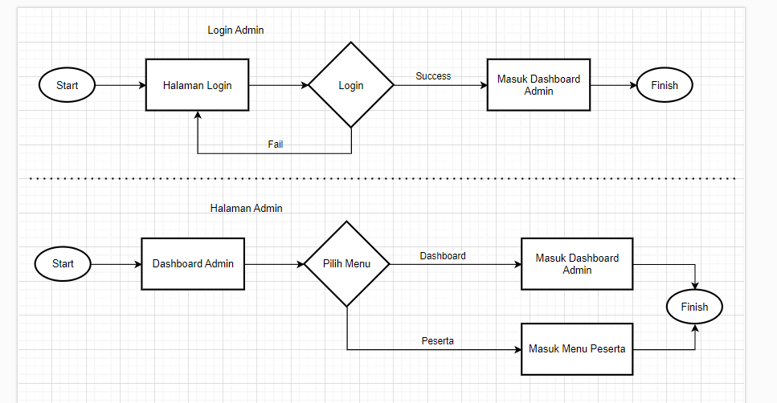

# Front End Admin Documentation

## Table of Contents

- [Flow Chart](#flow-chart)
- [Pages](#flow-chart)

## Flow Chart

## Pages

### I. Login

  

Feature :

- Provides a form where admin can input username and password to access the dashboard.

### II. Dashboard

  

Feature :

- Displays progress bar that representing specific statistics, for example display the progress of all students' assignments.
- Presents a summary of key information, such as the total number of users, and the average progress of all students' assignments.

### III. Peserta

  

Feature :

- Shows a list of participants with columns like name, city, gender and action
- Offers buttons or options for CRUD operations.

### IV. Tema

  

Feature :

- Displays a list of information about all users on each theme with columns such as name, task progress bar, and status of completed questions
