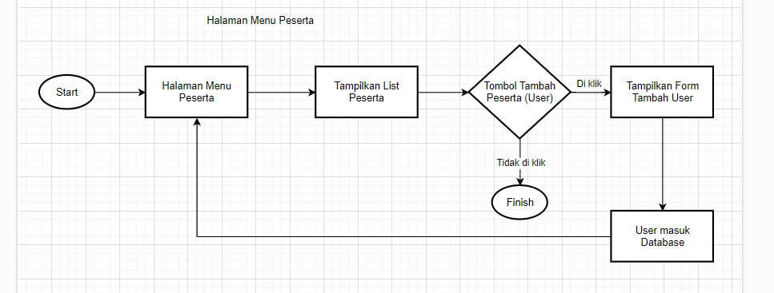

# Front End User Documentation

## Table of Contents

- [Flow Chart](#flow-chart)
- [Pages](#pages)

## Flow Chart

## Pages

### I. Landing Page

  

Feature :

- Display a visually appealing welcome message and introduction to the Talenesia Learning Journal.

### II. Login

Feature :

- Provides a form where users can input username and password to access the application.

### III. Learning Journey

  

Feature :

- Displays a list of user learning journeys.

### IV. Tema

  

Feature :

- Shows a starting screen for each theme's learning process.

### V. Form

  

Feature :

- Provides checklist form, and text where users can input their progress and their feedback to their mentors.
